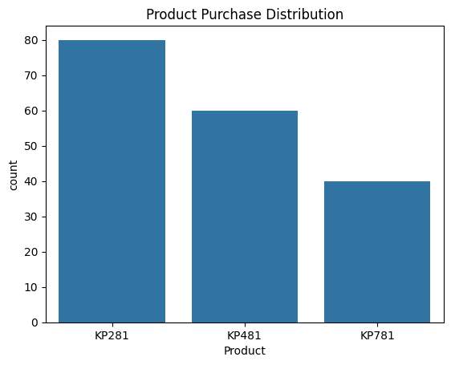
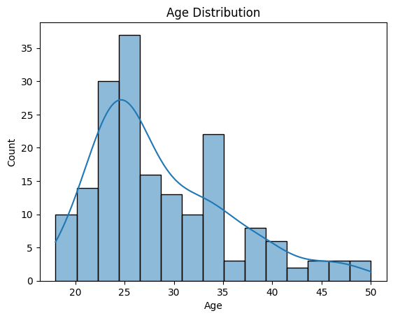
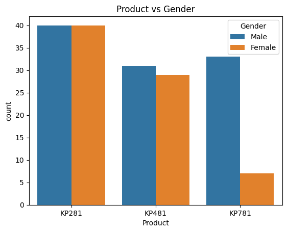
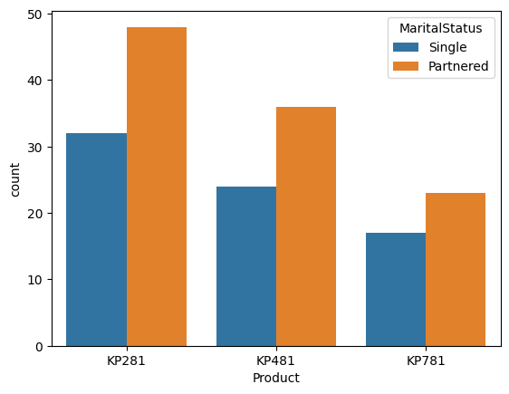
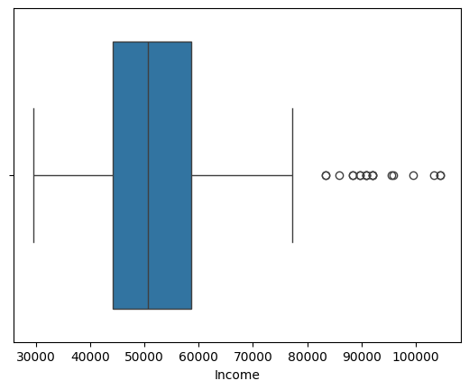
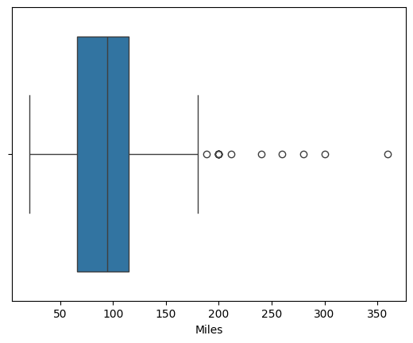
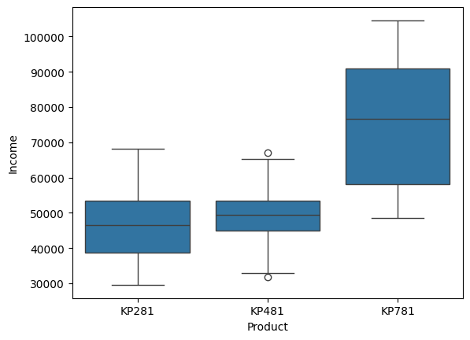
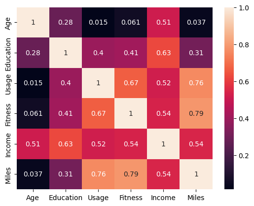

# Aerofit_Business_Case_Study
## Project Name : Aerofit - Descriptive Statistics & Probability 

### Objective : 
1.	Perform descriptive analytics to create a customer profile for each AeroFit treadmill product by developing appropriate tables and charts.
2.	For each AeroFit treadmill product, construct two-way contingency tables and compute all conditional and marginal probabilities along with their insights/impact on the business.

### Dataset

### Tools Used:
- Python
- Pandas
- NumPy
- Matplotlib
- Seaborn

### Workflow :
1. Data Cleaning
2. Exploratory Data Analysis
3. Feature Engineering
4. Visualization
5. Business Insights
   
### Files Included :

| File | Description |

| Aerofit_Business_Case_Study_Heena.ipynb | Analysis notebook |

| Aerofit_Business Case Study_Heena.pdf | Project report |

### About the Dataset
* **Source:** Confidential / Proprietary data source.
* **Size:** 180 rows and 09 features. 
* **Key Variables:** Product, Gender, MaritalStatus, Fitness, Income, Miles.

*Note: The raw dataset is omitted from this repository to protect data privacy and intellectual property.*

### Key Insights:
________________________________________
### Insight 1:

44.44 % customers buy KP281
33.33%  customers buy KP481
22.22%  customers buy KP781
________________________________________
### Insight 2:

KP281 has the highest sale.
Typical age of buyers is 22 to 26.
________________________________________
### Insight 3:

•	All products are purchased mostly by Male customers.
•	KP281 has equal purchase for Male and Female.
•	KP781 has the lowest sale in Female
•	Married people bought more products.
________________________________________
### Insight 4:

•	The income distribution shows a few high-income outliers.
•	These customers likely belong to the premium customer segment.
•	Such customers may prefer high-end treadmills like KP781 with advanced features.
•	These outliers indicate the presence of a luxury buyer segment in the market.
________________________________________
### Insight 5:

•	A few customers have significantly higher expected miles per week, indicating heavy treadmill usage.
•	These users are likely fitness enthusiasts or athletes.
•	These customers may prefer high-performance treadmills like KP781.
________________________________________
### Insight 6:

Age Observation
•	The average age of customers is around the early 30s.
•	The minimum age is around the early 20s, and the maximum age is around the late 40s.
________________________________________
### Insight 7: 

•	Most treadmill buyers belong to the young to middle-aged adult group.
•	This indicates that the primary target market for AeroFit is working professionals who are health conscious.
________________________________________
### Education Observation

•	Education ranges approximately from 12 to 21 years.
•	The average education level is around 15–16 years.
________________________________________
### Insight 8:

•	Most customers are well educated, likely college graduates.
•	This suggests that the product is popular among educated professionals who value health and fitness.
________________________________________
### Usage (Times per Week) Observation

•	The average treadmill usage is around 3–4 times per week.
•	Some customers plan to use it up to 7 times per week.
________________________________________
### Insight

•	Most customers intend to use the treadmill regularly as part of their weekly fitness routine.
•	A few heavy users may represent serious fitness enthusiasts or athletes.
________________________________________
### Income Observation

•	Customer income ranges widely from lower income levels to high income levels.
•	The mean income is higher than the median, suggesting the presence of high-income outliers.
________________________________________
### Insight

•	The dataset contains customers from different income groups.
•	High-income customers may be more inclined to purchase premium treadmills like KP781.
________________________________________
### Fitness Level Observation

•	Fitness levels range from 1 to 5.
•	The average fitness level is around 3.
________________________________________
### Insight

•	Most customers consider themselves moderately fit.
•	This indicates that the majority of buyers are intermediate fitness users rather than beginners or professional athletes.
________________________________________
### Miles (Expected Running Distance) Observation

•	Customers expect to run around 80–100 miles per week on average.
•	Some customers expect significantly higher mileage.
________________________________________
### Insight

•	This suggests that many users plan to use the treadmill for regular exercise and endurance training.
•	High-mileage customers may prefer advanced treadmills with better durability.
________________________________________
The descriptive statistics show that AeroFit customers are primarily young to middle-aged, well-educated individuals with moderate fitness levels who plan to use the treadmill regularly. Income distribution indicates the presence of both mid-level and high-income customers, suggesting demand for both entry-level and premium treadmill products.
________________________________________

### Visualizations:

   

	 

### Conclusion:

## Overall Business Insights:
________________________________________
### Insight 1
Most customers purchase KP281.
Meaning:
•	Beginners dominate the market.
________________________________________
### Insight 2
High income customers prefer KP781.
Meaning:
•	Premium customers exist but smaller segment.
________________________________________
### Insight 3
Fitness level strongly influences product choice.
Higher fitness → advanced treadmill i.e. KP781.
________________________________________
### Insight 4
Males slightly dominate KP781 purchases.
Possible marketing strategy: target male athletes.
________________________________________

## Business Recommendations
________________________________________
### Recommendation 1
Target beginners for KP281 marketing
•	gyms
•	apartments
•	home fitness beginners
________________________________________
### Recommendation 2
Promote KP781 to high income athletes
Channels:
•	running clubs
•	marathon communities
________________________________________
### Recommendation 3
Offer upgrade programs
KP281 users - KP481 after 1 year.
________________________________________
### Recommendation 4
Personalized recommendations in offline stores
Example:
If customer profile:
•	Fitness = 5
•	Income = High
•	Usage = 5
________________________________________
### Recommend - KP781
________________________________________

