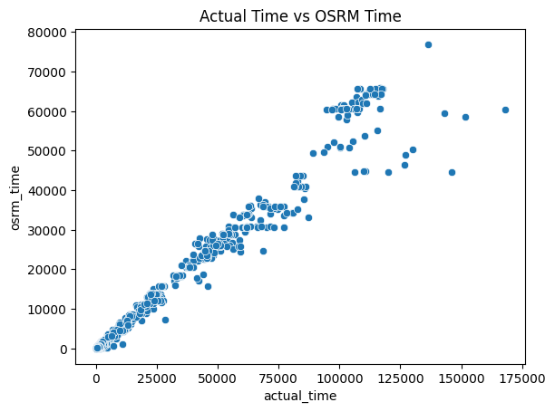
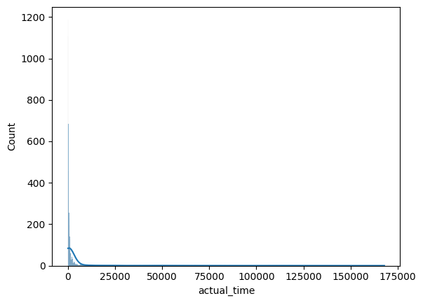
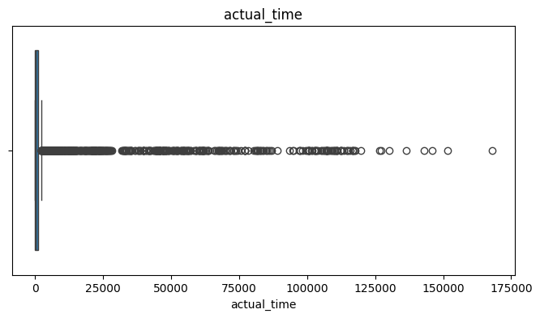
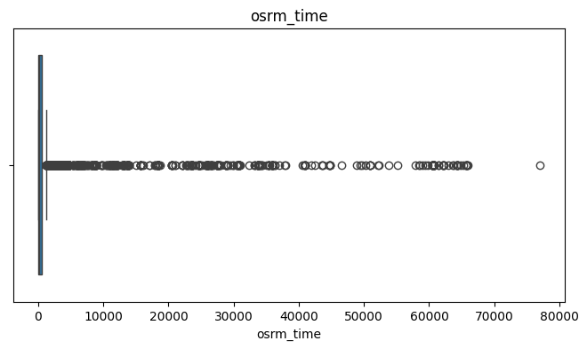
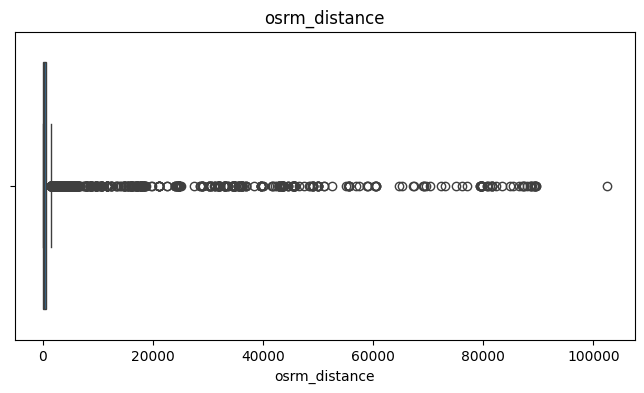
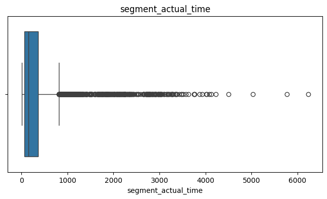
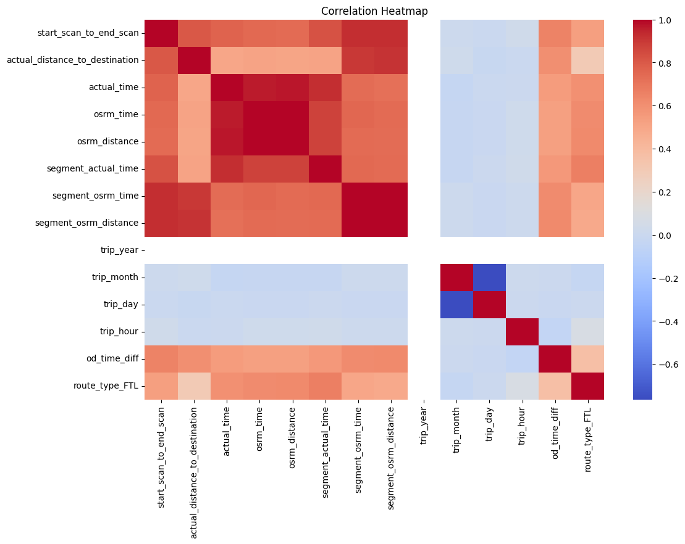

# Project Name : Delhivery- Feature Engineering

### Objective : 

Delhivery wants to analyze logistics and trip-level delivery data generated from engineering pipelines.

The main goals are:

- Clean and process raw logistics data
- Merge fragmented shipment records into meaningful trip-level information
- Perform exploratory data analysis (EDA)
- Engineer useful features
- Compare actual delivery performance vs OSRM estimated performance
- Detect and treat missing values and outliers
- Prepare the dataset for forecasting and machine learning models
- Generate actionable business insights and recommendations

### Tools Used:

- Python
- Pandas
- NumPy
- Matplotlib
- Seaborn

### About the Dataset
* **Source:** Confidential / Proprietary data source.
* **Size:** 21039 rows and 24 features. 
* **Key Variables:** trip_creation_time, route_schedule_uuid, source_center, od_start_time, actual_distance_to_destination, segment_actual_time, segment_osrm_distance etc.

*Note: The raw dataset is omitted from this repository to protect data privacy and intellectual property.*

  
### Workflow :

1. Data Cleaning
2. Exploratory Data Analysis
3. Feature Engineering
4. Visualization
5. Business Insights

   
### Files Included :

| File | Description |

| Delhivery_Business_Case_Study_Heena.ipynb | Analysis notebook |

| Heena_Delhivery Case Study.pdf | Project report |

### Key Insights:
________________________________________
### Important EDA Insights : 
________________________________________
### Time-Based Insights

- Actual delivery time is generally higher than OSRM estimated time. 
- Longer routes show higher delivery variability. 
- Peak-hour trips take significantly more time. 
________________________________________
### Distance Insights

-	 Distance and delivery time are strongly positively correlated. 
-	 Some trips have unusually high delivery time despite shorter distance → operational inefficiencies. 
________________________________________
### Route Insights

-   FTL routes are generally faster and more efficient than Carting routes.
-   Carting has higher delay variance due to multiple stops. 
________________________________________
### Operational Insights

-   Certain corridors contribute most deliveries.
-   Some warehouses repeatedly show delays. 
________________________________________
### Business Insights

### Insights 1
Majority of orders originate from metro cities and industrial hubs.
________________________________________
### Insights 2
Long-distance corridors show greater mismatch between OSRM predicted time and actual delivery time.
________________________________________
### Insights 3
Carting routes have higher turnaround time than FTL routes.

## Visualizations:

## Conclusion:

### Recommendation 1
Improve route optimization for corridors where actual time greatly exceeds OSRM estimates.
________________________________________
### Recommendation 2
Increase FTL usage for high-volume routes to reduce delays.
________________________________________
### Recommendation 3
Monitor warehouses with consistently high segment delays.
________________________________________
### Recommendation 4
Use dynamic traffic-aware routing instead of static OSRM estimates.

