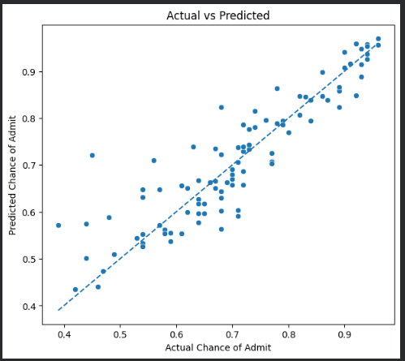

# 🎓 Jamboree Education – Graduate Admission Prediction

Predicting a student's **Chance of Admit** using Linear Regression and identifying the factors that influence graduate admission probability.

---

## 📌 Project Overview

This project analyzes graduate admission data to understand the factors associated with admission probability and builds a **Linear Regression model** to predict the `Chance of Admit`.

The analysis includes **Exploratory Data Analysis, correlation analysis, statistical modeling, regression diagnostics, and model evaluation**.

---

## 🎯 Business Objective

* Identify the key factors influencing graduate admission chances.
* Analyze relationships between academic/application attributes and admission probability.
* Build a model to predict `Chance of Admit`.
* Generate data-driven recommendations for students and Jamboree Education.

---

## 📊 Dataset

The dataset contains **500 graduate applicants** with the following variables:

| Feature           | Description                       |
| ----------------- | --------------------------------- |
| GRE Score         | GRE score out of 340              |
| TOEFL Score       | TOEFL score out of 120            |
| University Rating | University rating from 1–5        |
| SOP               | Statement of Purpose strength     |
| LOR               | Letter of Recommendation strength |
| CGPA              | Undergraduate CGPA                |
| Research          | Research experience               |
| Chance of Admit   | Estimated admission probability   |

`Serial No.` was excluded from modeling because it is only an identifier.

---

## 🔍 Analysis Performed

### Exploratory Data Analysis

* Data quality and descriptive statistics
* Univariate and bivariate analysis
* Distribution analysis
* Correlation analysis
* Relationship between applicant attributes and admission probability

### Statistical & Regression Analysis

* Pearson correlation
* Linear Regression using OLS
* Regression coefficient interpretation
* P-value analysis
* 95% confidence intervals
* Multicollinearity analysis using VIF

### Model Diagnostics

* Residual analysis
* Linearity assessment
* Homoscedasticity using Breusch-Pagan test
* Residual normality
* Q-Q plot
* Shapiro-Wilk test

### Model Evaluation

* MAE
* RMSE
* R²
* Adjusted R²
* Comparison of different Linear Regression models

---

## 📈 Key Findings

* **GRE, TOEFL, and CGPA** show positive relationships with `Chance of Admit`.
* **CGPA** is an important predictor of admission probability.
* Applicants with **research experience** tend to have higher admission chances.
* GRE, TOEFL, and CGPA are correlated with each other, indicating potential **multicollinearity**.
* The regression model explains a substantial portion of the variation in admission probability.
* The model achieved approximately **0.81 R² on the test data**.

---

## 📊 Model Performance

| Metric               | Result |
| -------------------- | -----: |
| Training R²          |  0.821 |
| Training Adjusted R² |  0.818 |
| Test R²              |  ~0.81 |
| MAE                  | ~0.043 |

An MAE of approximately **0.043** means that the model's predicted admission probability differs from the actual value by approximately **4.3 percentage points on average**.

---

## 📸 Visualizations

<table>
  <tr>
    <td align="center">
       
      <b>GER_Vs_Chance of admit</b>
    </td>
    <td align="center">
       
      <b>CGPA vs Chance of Admit</b>
    </td>
  </tr>
  <tr>
    <td align="center">
       
      <b>Residual Analysis</b>
    </td>
    <td align="center">
       
      <b>Actual vs Predicted</b>
    </td>
  </tr>
  <tr>
  <td align="center">
       
      <b>QQ Plot of Residual</b>
    </td>
  </tr>
</table>

---

## 💡 Business Recommendations

### 1. Admission Probability Predictor

Jamboree can use the model as a student-facing feature to provide an estimated admission probability based on an applicant's profile.

### 2. Personalized Student Guidance

The system can identify areas where students could strengthen their profile, such as GRE, TOEFL, CGPA, research experience, SOP, and LOR.

### 3. Improve Model Reliability

Monitor multicollinearity and validate the model on larger and more diverse datasets before using predictions in real-world decision-making.

### 4. Communicate Predictions Carefully

The predicted probability should be presented as a **statistical estimate and not a guarantee of admission**.

---

## 🔮 Example Prediction

For a hypothetical applicant with:

* GRE = 325
* TOEFL = 110
* University Rating = 4
* SOP = 4
* LOR = 4
* CGPA = 9.2
* Research = 1

the model predicted a **Chance of Admit of approximately 84.5%**.

---

## 🛠️ Technologies & Libraries

**Python | Pandas | NumPy | Matplotlib | Seaborn | Statsmodels | Scikit-learn | Google Colab**

---

## 📁 Project Files

* 📓 `Jamboree_Admission_Linear Regression.ipynb` — Complete analysis and model implementation
* 📄 `Jamboree_Case_Study_Report.pdf` — Detailed case study report
* 📄 `README.md` — Project documentation
* 📁 `images/` — Key visualizations

---

## 📝 Conclusion

The analysis shows that academic and application-related factors, particularly **GRE, TOEFL, CGPA, and research experience**, are associated with graduate admission probability.

The Linear Regression model provides a useful foundation for estimating admission chances and can be further improved through additional data, model validation, and careful handling of correlated predictors.

