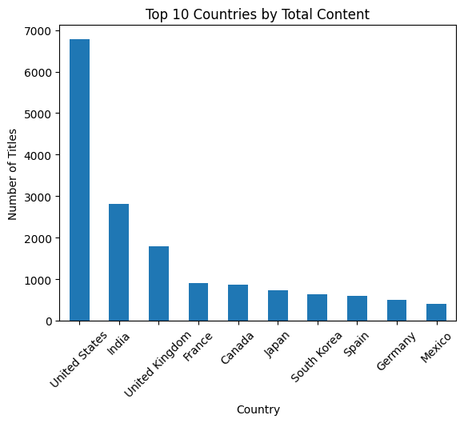
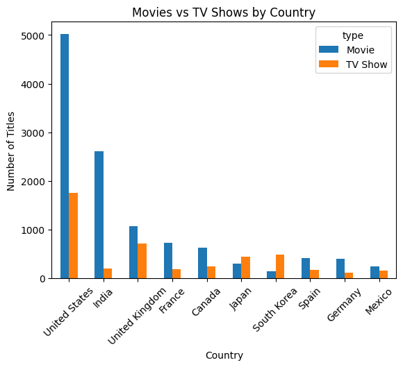
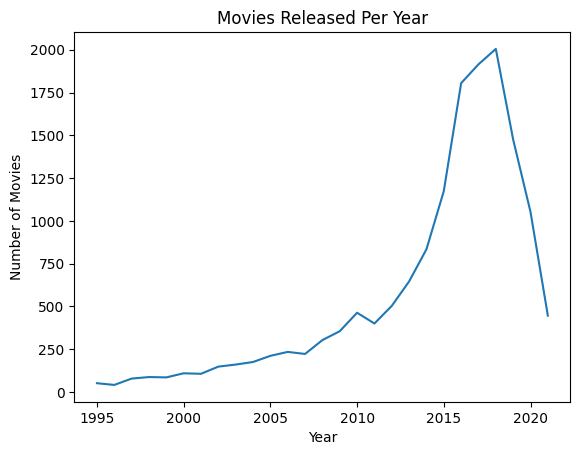
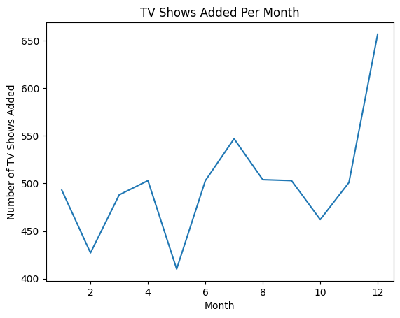
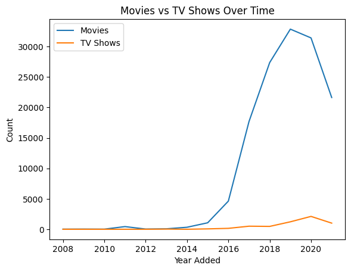

Project Name : Netflix : Data Exploration and Visualisation

Objective : 
Analyze the data and generate insights that could help Netflix in deciding which type of shows/movies to produce and how they can grow the business in different countries.

Dataset :
https://drive.google.com/file/d/1lolab9tA__68MJ0wCSeixvnar-7RKx1K/view?usp=drive_link
Tools Used:
- Python
- Pandas
- NumPy
- Matplotlib
- Seaborn
Workflow :
1.	Data Cleaning
2.	Exploratory Data Analysis
3.	Visualization
4.	Business Insights
Files Included :
| File | Description |
| Netflix_Business_Case_Study_Heena.ipynb | Analysis notebook |
https://drive.google.com/file/d/1lolab9tA__68MJ0wCSeixvnar-7RKx1K/view?usp=drive_link |Dataset |
| Netflix Business Case Study-Heena Khan.pdf | Project report |

Key Insights:
Insights 1

- United State produces the most diverse content. 
- India is on second rank in producing the diverse content.
________________________________________
Insights 2

- United State is movie-heavy and also top country in producing TV shows as compare to other countries.
- India is on second rank in producing Movies but produces less TV shows.
________________________________________
Insights 3

International Movies is the most common genre across countries.
________________________________________
Observations
1990s

- Very few movies available on platform.
- Mostly older catalog content.
2000–2010

  
- Gradual increase.
- More global expansion.
2015–2019

  
- Sharp increase.
- Peak production and acquisition period.
2020

  
- Slight decline or plateau.
- Likely impact of COVID-19 on production.

Pattern Summary
Period	Trend
1995–2005	                                      Slow growth
2006–2014	                                     Moderate increase
2015–2019	                                     Rapid growth
2020+	                                     Slight drop / stabilization

________________________________________
Insights 4

- Strong growth after 2015 indicates aggressive content expansion.
- Peak years show high investment in original movies.
- Slight drop around 2020 may be due COVID-19 pandemic.
- Continuous high production post-2015 reflects competition with other platforms.
________________________________________
Insights 5

TV Shows help improve subscriber retention, while Movies drive new subscriptions.
________________________________________
Observations

- Peak additions in February, May-June  and October to December Month
- High activity also in December
- Lowest in August-September
________________________________________
Business Interpretation:
Best Time to Launch:
May

- Summer vacation in many countries
- High viewer engagement
- Less competition from traditional TV seasons
December

- Holiday season
- High binge-watching behavior
________________________________________

- Some actors appear mostly in Movies.
- Some actors dominate TV Shows.
- Very few actors dominate both categories equally.
- Most directors specialize in Movies.
- Fewer directors consistently produce multi-season TV Shows.
- TV series often involve multiple directors per show.
Before 2015

- More Movies added than TV Shows
2015–2019

  
- TV Shows grow faster than Movies
- Netflix invests heavily in originals like Stranger Things, House of Cards, etc.
2019–2021

  
- TV Shows often outpace Movies in additions
- Especially after binge-watch format success
- Movies still added, but TV Show growth is stronger
________________________________________
- Zimbabwe- Movie-heavy actors
- USA → Balanced industry
________________________________________
Visualizations:

________________________________________

Conclusion:
Business Insights:
TV Shows Might Be Focused More Recently because:

- Retention
- TV Shows keep subscribers longer (multi-season engagement)
- Binge-watching Behaviour
- Episodic content increases total watch time
- Global Local Content
- Different countries produce localized series

Netflix shows a stronger growth trend in TV Shows than Movies in recent years, and strategically this makes sense because:

- TV Shows drive longer user engagement
- They build series brand loyalty
- They are better for global content strategies
- They reduce churn compared to single movies
________________________________________
Business Recommendations:

- Sign actors with strong repeat presence in successful genres.
- Invest in directors who have consistent high-performing series.
- Identify cross-over talent (actors successful in both movies & series).
- Promote regional stars globally.
- Use country-specific content strategy
- Invest in high-performing genres per region
- Promote regional hits globally
- Increase series production in movie-heavy countries

