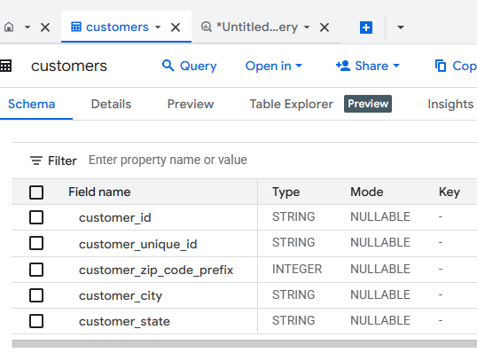

Project Name : Walmart - Confidence Interval and CLT  

Objective : 
Business Problem
Assuming you are a data analyst/ scientist at Target, you have been assigned the task of analyzing the given dataset to extract valuable insights and provide actionable recommendations based on the given questions.

### About the Dataset
* **Source:** Confidential / Proprietary data source.
* **Tales:** Total 08 Tables (customers, geolocation, order_items, order_reviews, orders, payments, products, sellers)
*Note: The raw dataset is omitted from this repository to protect data privacy and intellectual property.*

SQL Concepts Applied:
- SELECT Statements
- WHERE Filtering
- GROUP BY and HAVING
- Aggregate Functions
- CASE Statements
- Joins
- Union
- Common Table Expressions (CTEs)
- Window Functions
- Subqueries
- Date Functions
## Database Platform

- Google BigQuery
- Standard SQL
Files Included :
| File | Description |
| Target-SQL.sql| Analysis notebook |
| Business Case Study -Target SQL Solution.pdf| Project report |

Analysis:
Trend Analysis 1:
1.	Number of orders placed are drastically increased in year 2017 as compared to year 2016.
2.	Number of orders placed are increased in year 2018 as compared to year 2017.
3.	The percentage increase is 137% from year 2017 to 2018 in the first 8 months i.e. January to August.
________________________________________
Trend Analysis 2:
1.	In high volume states like BA,DF,ES,GO,PR,RJ,SC,SP (details taken from total_orders column), need to increase sell (can be through marketing) as their average order price is low comparing to volume.
2.	States like AC, AM,AP,RR,AC,TO have low volume of orders but the average order price is good enough. There might be Premium customers.
3.	AM,AP,RN,RR have high average freight value considering the total freight value. (May be due to high shipping cost or remote orders). 
________________________________________
Trend Analysis 3:
1.	Many orders have positive diff_estimated_delivery, that means the actual delivery is delayed for that many days. Which can affect the business as customers can cancel orders, give poor ratings or return products.
2.	Need to calibrate the estimated delivery or improve logistics. 
________________________________________
Trend Analysis 4:
1.	The delivery speed of these 5 top states is very good (according to the estimated dates).
2.	Optimizing delivery estimates in these states can increase accuracy.
3.	These logistics practices can be followed to improve performance in slower regions.
4.	Most popular payment method is “Credit/Debit Card”.
5.	Most of the orders are single installment payments that means customers pay one time.
6.	Higher installment orders are less frequent, which may indicate higher-value purchases are less.
________________________________________
Visualizations:

|  |  |
________________________________________

Conclusion:
Business Insights and Analysis
Order Growth and Business Expansion
•	The business experienced significant growth in order volume from 2016 to 2017, followed by continued growth in 2018. 
•	During the first eight months of 2018, orders increased by approximately 137% compared to the same period in 2017, indicating strong customer acquisition and market expansion. 
•	Sustained growth suggests increasing demand and a scalable business model. 
Regional Performance and Customer Segmentation
•	High-volume states such as BA, DF, ES, GO, PR, RJ, SC, and SP generate a large number of orders but have relatively low average order values, indicating opportunities to increase revenue through targeted marketing, cross-selling, and upselling strategies. 
•	States like AC, AM, AP, RR, and TO have lower order volumes but higher average order values, suggesting the presence of premium or high-value customers. 
•	These regions can be targeted with premium products and personalized marketing campaigns. 
Logistics and Freight Cost Analysis
•	States including AM, AP, RN, and RR have relatively high freight costs, possibly due to remote locations or expensive shipping routes. 
•	Elevated logistics costs may reduce profitability and affect customer satisfaction if not managed efficiently. 
Delivery Performance
•	A considerable number of orders were delivered later than their estimated delivery dates. 
•	Delivery delays can negatively impact customer experience, resulting in cancellations, returns, and lower customer ratings. 
•	Some states demonstrate consistently strong delivery performance, indicating that efficient logistics practices already exist within the organization. 
Payment Behavior
•	Credit/Debit cards are the most preferred payment methods among customers. 
•	Most purchases are completed using single-installment payments. 
•	Multi-installment purchases are relatively infrequent, suggesting that higher-value transactions form a smaller proportion of overall sales. 
________________________________________
Business Recommendations
1. Increase Revenue in High-Volume States
•	Implement targeted marketing campaigns in high-order-volume states. 
•	Promote complementary products through cross-selling and upselling. 
•	Introduce personalized recommendations to increase average order value. 
2. Strengthen Premium Customer Strategy
•	Develop loyalty programs and premium offerings for states with high average order values. 
•	Focus on customer retention and personalized engagement for high-value customers. 
3. Optimize Logistics Costs
•	Analyze shipping routes and warehouse locations in high-freight regions. 
•	Consider regional distribution centers or partnerships with logistics providers to reduce transportation costs. 
•	Monitor freight expenses regularly to maintain profitability. 
4. Improve Delivery Accuracy
•	Recalibrate estimated delivery timelines to better match actual delivery performance. 
•	Identify bottlenecks in the supply chain and logistics operations. 
•	Replicate successful logistics practices from high-performing states to slower regions. 
5. Enhance Customer Experience
•	Reduce delivery delays to minimize cancellations, returns, and negative reviews. 
•	Improve communication regarding shipment status and expected delivery times. 
•	Introduce proactive customer support for delayed orders. 
6. Increase High-Value Purchases
•	Encourage installment-based purchasing through promotional financing options. 
•	Offer discounts or cashback on higher-value transactions. 
•	Design campaigns aimed at increasing average basket size and premium product adoption. 

