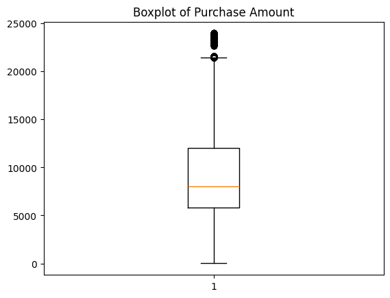
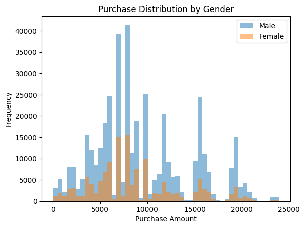
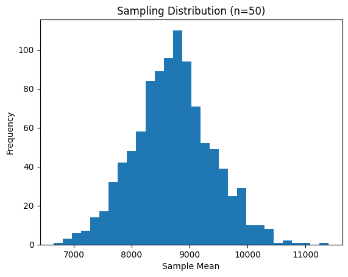
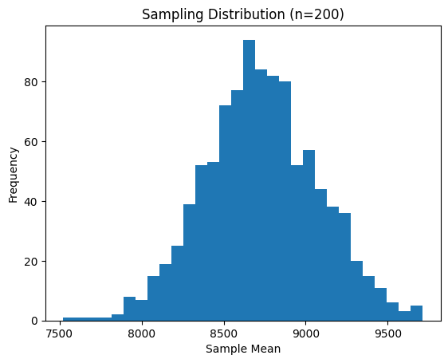
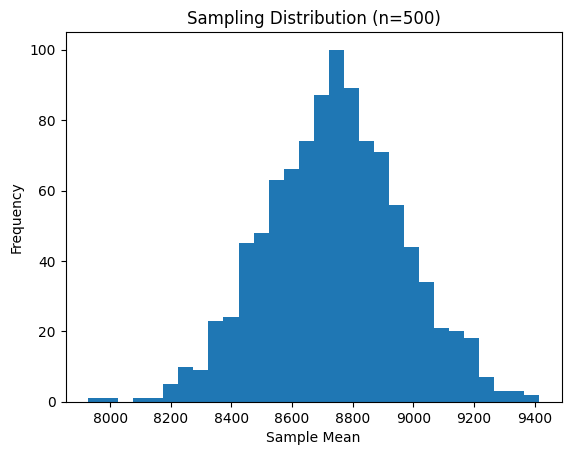
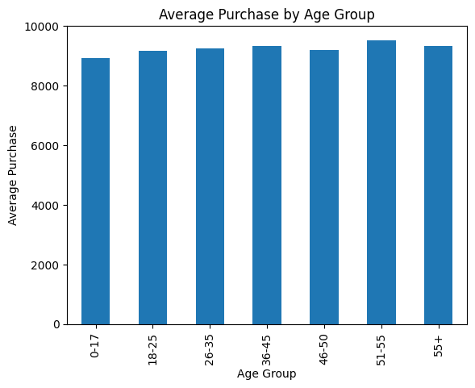

Project Name : Walmart - Confidence Interval and CLT  

Objective : 
Business Problem
The Management team at Walmart Inc. wants to analyze the customer purchase behavior (specifically, purchase amount) against the customer’s gender and the various other factors to help the business make better decisions. They want to understand if the spending habits differ between male and female customers: Do women spend more on Black Friday than men? (Assume 50 million customers are male and 50 million are female).

### Dataset
The dataset used for this analysis can be found here: [Google Drive Dataset Link]( https://drive.google.com/file/d/1lGwT3pY2p7GPVSdySkG1RcT3D4P7qy-K/view?usp=sharing)

### About the Dataset
* **Source:** Confidential / Proprietary data source.
* **Size:** 550068 rows and 10 features. 
* **Key Variables:** Occupation, City_Category, Marital_Status, Product_Category.

*Note: The raw dataset is omitted from this repository to protect data privacy and intellectual property.*
Tools Used:
- Python
- Pandas
- NumPy
- Matplotlib
- Seaborn
Workflow :
1.	Data Cleaning
2.	Exploratory Data Analysis
3.	Hypothesis Testing
4.	Visualization
5.	Business Insights
Files Included :
| File | Description |
| WallMart_Business_Case_Study_Heena.ipynb| Analysis notebook |
| WallMart_Business_Case_Study_Heena.pdf| Project report |

Key Insights:
Insights 1

•	If male_mean > female_mean → men spend more
•	If female_mean > male_mean → women spend more
Men spend slightly more per transaction
•	Male Mean =    9437.5260 
•	Female Mean= 8734.5657 
________________________________________
Insights 2
•	Larger sample → more stable mean
•	Distribution becomes normal (bell curve)
________________________________________
Insights 3

●	If overlap → same marketing strategy works
●	If not → gender-specific targeting needed
●	Married → family purchases (higher spend)
●	Unmarried → personal purchases

________________________________________
Visualizations:

________________________________________

Conclusion:
Business Conclusions
Gender Insights
●	Men slightly spend more per transaction
●	But difference may not be statistically significant
Marital Status
●	Married customers often spend more
●	Likely buying for families
Age Insights
26–35 is the most valuable segment________________________________________
Business Recommendations:
Recommendations:
Marketing Strategy
●	Target 26–35 age group with premium offers
●	Family bundles for married customers
Personalization
●	Gender-based promotions only if CI shows difference
●	Otherwise, avoid unnecessary segmentation
Pricing Strategy
●	High-value customers → loyalty rewards
●	Younger segment → discounts
Inventory Planning
●	Stock more products for:
○	Working professionals
○	Family categories

================ FINAL INSIGHTS ================
✔ Significant difference between Male & Female spending
✔ No significant difference between Married & Unmarried spending
✔ Highest spending age group: 51-55

===============================================

